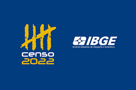

 

  <h3 align="center">Census Management</h3>

  

    Database-backed RPA solution 
  

  

  
Table of Contents

  <ol>
    <li>
      <a href="#about-the-project">About The Project</a>
    <li>
      <a href="#challenges">Challenges</a>
    </li>
    <li><a href="#solutions">Solutions</a></li>
    <li>
      <a href="#future improvements">Future improvements</a>
     </li>
     <li>
      <a href="#technologies">Technologies</a>
     </li>

  </ol>

## About The Project

Brazilian Census is one of the biggest government operations in the country. It employs over a 100.000 people and presents unique challenges regarding payroll activities. This application solves a critical issue identified in a previous census: management of the canceled payments.
Many financial operations at the federal level are still done through a legacy system based on a 3270 terminal emulation (https://www.serpro.gov.br/links-fixos-superiores/emulador-hod/emulador-hod). While modern web-based applications do exist, for canceled payments the only real-time solution requires using a system that was not built for bulk processing of data.
This is a one-man army project, implemented when I was a financial analyst at IBGE. 

## Challenges
* Cancelations may take 2 work days or 10 days, depending on the payment type 
* Access to raw cancelation data is very restricted
* The volume of data is too high for manual processing (between 20.000 and 100.000 data points per day)
* Legacy system is only available at work days from 8AM to 10PM, so development time was also restricted

## Solution
* A first layer of automation was created to interact with the legacy system
* Extraction and enrichment of data were performed on a local data lake and a local database (MongoDB)
* Collection and transformation of raw text data into spreadsheets were done using Python
* The final product was a spreadsheet, automatically emailed in the format specified by business analysts downstream

## Future improvements
This project is finished. The RPA solution could very well evolve into some form of API, but since payroll operations of this scale are unique to IBGE, the cost of development outweighs the benefits of the API. 

## Technologies
Python
 
MongoDB 
